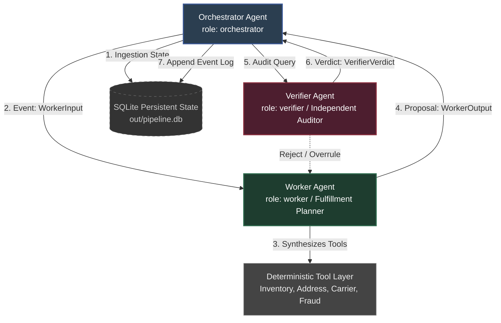

# Agent Topology Architecture - CASE_ID: CEDX-3E31C1 (E-commerce Operations)

The Tiny CEDX Agent Fleet governs the processing and validation of e-commerce orders, ensuring that stock allocation, address checking, carrier rating, and fraud assessment are executed with strict independent verification.

Below is the structured topology mapping agent roles, message schemas, and state validation paths.

## Agent Roster & Directed Calling Graph

### 1. Orchestrator Agent (`orchestrator`)
* **Role Summary:** Coordinates workflow progression through sequential `PipelineState` transitions. It routes typed event messages, enforces policy boundaries (step and cost limits), manages repair loops upon Verifier rejection, and runs the Model Router.
* **Contracts:** 
  * Input: Ingested order records from SQLite.
  * Output: Transformed `PipelineState` to next workflow stage or routed exceptions to `out/exception_queue.json`.
  * Permissions (`can_call`): `["worker", "verifier"]`

### 2. Worker Agent (`worker`)
* **Role Summary:** Acts as the Fulfillment Planning Agent. It queries the deterministic Tool Layer to synthesize carrier rates, stock availability, and address checks to draft a structured fulfillment package.
* **Contracts:**
  * Input: `WorkerInput` (normalized record + tools outputs).
  * Output: `WorkerOutput` (Pydantic model containing stock, carrier selection, shipping cost, address verification status, fraud risk score, and a drafted branded package).
  * Permissions (`can_call`): `[]` (receives instructions exclusively from Orchestrator).

### 3. Verifier Agent (`verifier`)
* **Role Summary:** Acts as the Independent Critic and Auditor. It reviews the Worker's drafted package directly against the normalized source order and deterministic tools outputs. Operating without access to the Worker's internal reasoning, it validates details (e.g. flagging hallucinated carriers like `"SpaceX Rocket"`) and possesses authority to overrule the proposal.
* **Contracts:**
  * Input: Normalized record + Worker's `delivered_fields`.
  * Output: `VerifierVerdict` (pass/fail verdict, status, and detail discrepancies).
  * Permissions (`can_call`): `[]` (independent critic role).

---

## State Machine Transition Path

The system enforces a governed state machine to prevent records from bypassing compliance checkpoints:

$$\text{INGESTED} \longrightarrow \text{NORMALIZED} \longrightarrow \text{VALIDATED} \longrightarrow \text{ASSEMBLED} \longrightarrow \text{VERIFIED} \longrightarrow \text{OPS\_APPROVED} \longrightarrow \text{COMPLIANCE\_APPROVED (conditional)} \longrightarrow \text{DELIVERED}$$

1. **INGESTED:** Loaded into SQLite with input hash.
2. **NORMALIZED:** Mapped schema-drift fields.
3. **VALIDATED:** Checked for STALE, MISSING_INPUT, and OUTLIER.
4. **ASSEMBLED:** Worker drafted package.
5. **VERIFIED:** Verifier certified correctness.
6. **OPS_APPROVED:** Operator signed off.
7. **COMPLIANCE_APPROVED:** If amount $\ge$ $45,000$, compliance officer signs off (otherwise skips).
8. **DELIVERED:** Written to `out/packages/` and cryptographically chained to `out/audit.json`.
